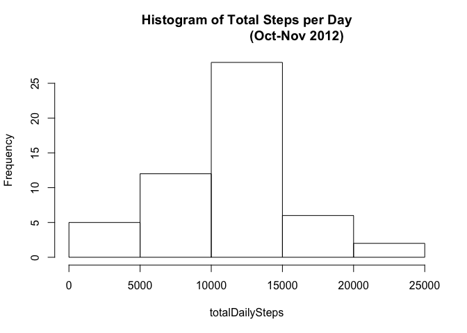
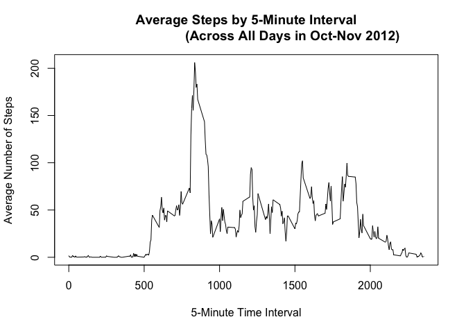

#Reproducible Research: Peer Assessment 1

##Activity Monitoring Study

###Introduction

This study examines the activity of an anonymous individual, in the form  
of data collected by a personal activity monitoring device.  
Specifically, the numbers of steps taken are reported in 5-minute  
intervals each day over a two-month period (October-November 2012).

The variables included in the dataset are:  

- **steps**: Number of steps taking in a 5-minute interval (missing values  
are coded as 𝙽𝙰)

- **date**: The date on which the measurement was taken in YYYY-MM-DD format

- **interval**: Identifier for the 5-minute interval in which measurement  
was taken (e.g., 405 identifies the period from 4:05 am to 4:10 am)

###Load Dataset and Packages  
The dataset has been downloaded as a comma-separated-value (csv) file and  
will be read in with the following code. In addition, other packages will  
be loaded.


```r
activityData <- read.csv("activity.csv")
library(dplyr)
```

```
## 
## Attaching package: 'dplyr'
## 
## The following objects are masked from 'package:stats':
## 
##     filter, lag
## 
## The following objects are masked from 'package:base':
## 
##     intersect, setdiff, setequal, union
```

```r
library(ggplot2)
```

###Total Steps by Day - Histogram, Mean, and Median  
The following code sums the total steps by day and generates a **histogram**:


```r
byDay <- group_by(activityData, date)
totalStepsByDay <- summarize(byDay, totalDailySteps = sum(steps))
with(totalStepsByDay, hist(totalDailySteps, main="Histogram of Total Steps per Day
                           (Oct-Nov 2012)"))
```

 


###Mean and Median Number of Steps Per Day
The **mean** and **median** number of steps taken per day are calculated by  
the following code:


```r
meanSteps <- mean(totalStepsByDay$totalDailySteps, na.rm = TRUE)
medianSteps <- median(totalStepsByDay$totalDailySteps, na.rm = TRUE)
```

**Mean** Steps Taken Per Day: 1.0766189\times 10^{4}

**Median** Steps Taken Per Day: 10765

### Average Daily Activity Pattern (by 5-Minute Intervals)  
Let's now explore whether we can identify an average daily activity pattern.  
There are 288 5-minute intervals in a day (12 intervals/hour x 24 hours/day).  
The **time-series plot** generated by the following code shows the average  
number of steps taken in each 5-minute interval (averaged over the 61 days  
in the October-November 2012 period).


```r
byInterval <- group_by(activityData, interval)
avgStepsByInterval <- summarize(byInterval, avgIntervalSteps = 
                        mean(steps, na.rm = TRUE))
with(avgStepsByInterval, plot(interval, avgIntervalSteps, type = "l",
                         main = "Average Steps by 5-Minute Interval
                         (Across All Days in Oct-Nov 2012)",
                         xlab = "5-Minute Time Interval",
                         ylab = "Average Number of Steps"))
```

 

###5-Minute Interval with Maximum Number of Steps
It might be of interest to see which 5-minute interval, on average across  
all the days in the dataset, contains the maximum number of steps. This is
computed by the following code:


```r
maxStepsInterval <- 
        avgStepsByInterval$interval[which.max(avgStepsByInterval$avgIntervalSteps)]
maxStepsInterval
```

The identifier for the 5-minute interval that, on average, contains the  
maximum number of steps is 835 (i.e., 8:35 am to 8:40 am).  
This interval could possibly coincide with this individual's regular  
exercise time or walking time to work.

###Imputing Missing Values  
There are a number of days/intervals in the dataset that have missing values  
(coded as NA).  

The following code will  

1. Calculate and report the total number of missing values in the dataset  
(i.e. the total number of rows with NAs). Note that only the **steps**  
variable has missing values.  

2. Create a new data frame by first copying the original data frame  
(**activityData**) to a new data frame called **activityDataComplete** (which  
initially still has missing values for steps) and then merging this new  
data frame with the previously-created **avgStepsByInterval** data frame  
(which has an avgIntervalSteps variable that averages the number of steps  
taken by interval averaged across all days in the two-month period). Note  
that the avgStepsByInterval data frame has no missing values.  

3. In the newly-merged **activityDataComplete** data frame, create a  
new variable called **stepsComplete**, which will have the same values as  
the variable **steps**, except that NA values will be replaced by the  
value in **avgIntervalSteps**, the average number of steps in that interval.  

4. Finally, only the **stepsComplete**, **date**, and **interval** variables  
are selected, so that the new data frame **activityDataComplete** will be  
equal to the original dataset but with the missing data filled in.  


```r
summary(activityData)
```

```
##      steps              date          interval     
##  Min.   :  0.00   10/1/12 :  288   Min.   :   0.0  
##  1st Qu.:  0.00   10/10/12:  288   1st Qu.: 588.8  
##  Median :  0.00   10/11/12:  288   Median :1177.5  
##  Mean   : 37.38   10/12/12:  288   Mean   :1177.5  
##  3rd Qu.: 12.00   10/13/12:  288   3rd Qu.:1766.2  
##  Max.   :806.00   10/14/12:  288   Max.   :2355.0  
##  NA's   :2304     (Other) :15840
```

```r
sumMissingValuesInSteps <- sum(is.na(activityData$steps))
sumMissingValuesInSteps
```

```
## [1] 2304
```

```r
activityDataComplete <- activityData
activityDataComplete$interval <- as.factor(activityDataComplete$interval)
avgStepsByInterval$interval <- as.factor(avgStepsByInterval$interval)
activityDataComplete <- merge(activityDataComplete, avgStepsByInterval,
                               by="interval")
activityDataComplete <- transform(activityDataComplete,
                stepsComplete = ifelse(is.na(steps),
                avgIntervalSteps, steps))
activityDataComplete <- activityDataComplete[c("stepsComplete",
                "date", "interval")]
```

###Total Steps by Day - Histogram, Mean, and Median (No Missing Values)
The following code sums the total steps by day and generates a **histogram**  
using the dataset with no missing values (i.e., where NAs have been  
replaced by imputed values as described above):


```r
byDay2 <- group_by(activityDataComplete, date)
totalStepsByDay2 <- summarize(byDay2, totalDailySteps2 = sum(stepsComplete))
with(totalStepsByDay2, hist(totalDailySteps2,
        main="Histogram of Total Steps per Day
                           (Oct-Nov 2012)"))
```

 

###Mean and Median Number of Steps Per Day
The mean and median number of steps taken per day are calculated by the
following code:


```r
meanSteps2 <- mean(totalStepsByDay2$totalDailySteps2, na.rm = TRUE)
medianSteps2 <- median(totalStepsByDay2$totalDailySteps2, na.rm = TRUE)
```

**Mean** Steps Taken Per Day: 1.0766189\times 10^{4}

**Median** Steps Taken Per Day: 1.0766189\times 10^{4}

These values do not differ much from the estimates from the first part  
of the assignment. In this particular case there seems to be little impact  
from imputing missing data on the estimates of the total daily number of  
steps.

#Activity Patterns: Weekends vs. Weekdays
We might expect that there could be differences in activity patterns  
between weekdays and weekends. To explore this, we need to group the  
dataset into weekdays and weekends so that we can identify any differences.

The following code 

1. Creates a new factor variable in the dataset with two levels –  
“weekday” and “weekend” indicating whether a given date is a weekday 
or weekend day.  

2. Uses this new factor variable to create a panel plot comparing the average  
number of steps taken across weekdays and weekends. Note that the plots are  
aligned vertically to permit easier comparison of weekday and weekend  
activity across like intervals.  


```r
df <- activityDataComplete
df$date <- as.Date(df$date, format="%m/%d/%y")
df <- mutate(df, dayOfWeek = weekdays(df$date))
df$dayOfWeek <- as.factor(df$dayOfWeek)
df$dayType <- df$dayOfWeek
df <- mutate(df, dayType = ifelse(dayOfWeek %in% c("Saturday", "Sunday"),
                                  "weekend", "weekday"))

byDayType_Interval <- group_by(df, dayType, interval)
avgStepsByDayType_Interval <- summarize(byDayType_Interval,
                                avgDayType_IntervalSteps =
                                mean(stepsComplete))

g <- ggplot(avgStepsByDayType_Interval,
        aes(x=interval, y=avgDayType_IntervalSteps, group = 1))
g <- g + geom_line() + facet_grid(dayType ~ .)
g <- g + ggtitle("Average Number of Steps by 5-Minute Interval (Oct-Nov 2012)")
g <- g + xlab("5-Minute Interval") + ylab("Average Number of Steps")
g
```

 
